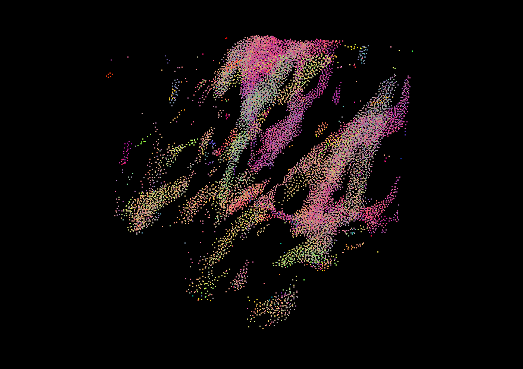
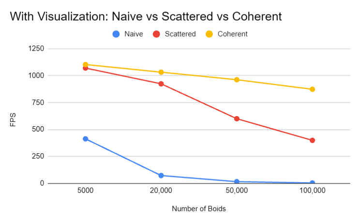
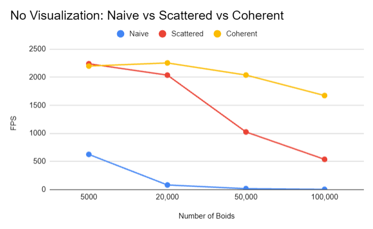
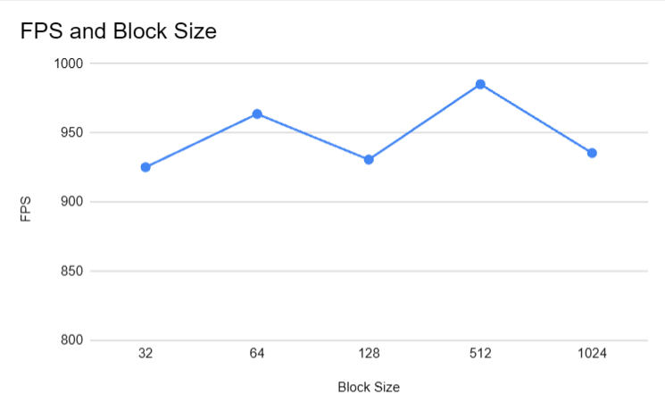

**University of Pennsylvania, CIS 5650: GPU Programming and Architecture,
Project 1 - Flocking**

* Alice Liu
  * [LinkedIn](https://www.linkedin.com/in/aliceliuu/), [personal website](https://aliceliu.xyz/)
* Tested on: Windows 11, AMD Ryzen 5 7640HS @ 4.30GHz 16GB, RTX 4060 Laptop GPU 8GB (Personal Laptop)

## CUDA Boid Flocking

   
  Coherent Uniform Grid Implemention with 17,000 Boids

## Overview

In this project, I implemented boid flocking in CUDA. A boid is a bird/fish-like object that moves according to some rules.

* Rule 1: Boids try to fly towards the centre of mass of neighbouring boids
* Rule 2: Boids try to keep a small distance away from other objects (including other boids)
* Rule 3: Boids try to match velocity with near boids

Applying these rules to each boid at each timestep, I was able to simulate their movement. In order to do this, I had three stages of implementation, each building on the last to make the simulation more efficient and optimized for the GPU. 

### Naive Implementation
The Naive implementation simply has every boid check every other boid in the simulation, and tests if it within a certain distance such that it affects it's movement. This implementation is very inefficient, especially when there are very large numbers of boids, as many of the checks are wasted.

### Scattered Uniform Grid Implementation
The Scattered Uniform Grid implementation is a substantial improvement from the Naive implementation. It uses a data structure known as a uniform spatial grid, which is made up of cells at least as wide as the neighborhood distance of the boids. As a preprocess step, we bucket each boid into a cell in the grid so that each boid only needs to check the boids within its few neighbor grid cells (which can range from 8-27 depending on the neighborhood distance of the boids). This allows us decrease the number of neighbor boids we check significantly. 

### Coherent Uniform Grid Implementation
The Coherent Uniform Grid implementation further improves on the Scattered Uniform Grid implementation by rearranging the boid velocity and position data such that it is contiguous in memory. This removes indirection and helps avoid memory jumps on the GPU, which helps with caching. 

## Performance Analysis

### Framerate with Increasing Number of Boids

   

   

From this data, we can see that increasing the number of boids causes the framerate of each implementation to decrease. However, we can see the the Naive implementation's has the most dramatic drop, followed by Scattered, followed then by Coherent. Generally, Naive has the worst framerate, followed by Scattered, followed then by Coherent. This makes sense because it's in order of number of optimizations done. The Naive implementation has a complexity of O(N^2), so when the number of boids increases, the amount of work it needs to do increases significantly. On the other hand Scattered Uniform Grid is faster because boids only check their immediate neighbors. Coherent is even better because it reduces the number of memory jumps. 

No visualization has a consistently better framerate than with visualization. The performance almost doubles with no visualization. 

### Framerate with Increasing Block Size

   

I tested this with the Coherent implementation, 50k boids, and with visualization on. From the data, it looks like changing block size does not have a huge impact on performance. This is because the boid simulation is memory-bound rather than compute-bound. However, 512 seems to be the peak. 

### Framerate with Changing Cell Width
I tested this with the Coherent implementation, 50k boids, and with visualization on. Changing cell width and checking 27 vs 8 neighboring cells did have an effect on performance, but not in the way I would have thought. Checking 27 gave me a performance of 1031.07 FPS while checking 8 gave me a performance of 930.69 FPS. This is likely due to that fact that even though there are more cells to check, the volume of each cell is smaller, so there can be less boids within the 27 to check.

